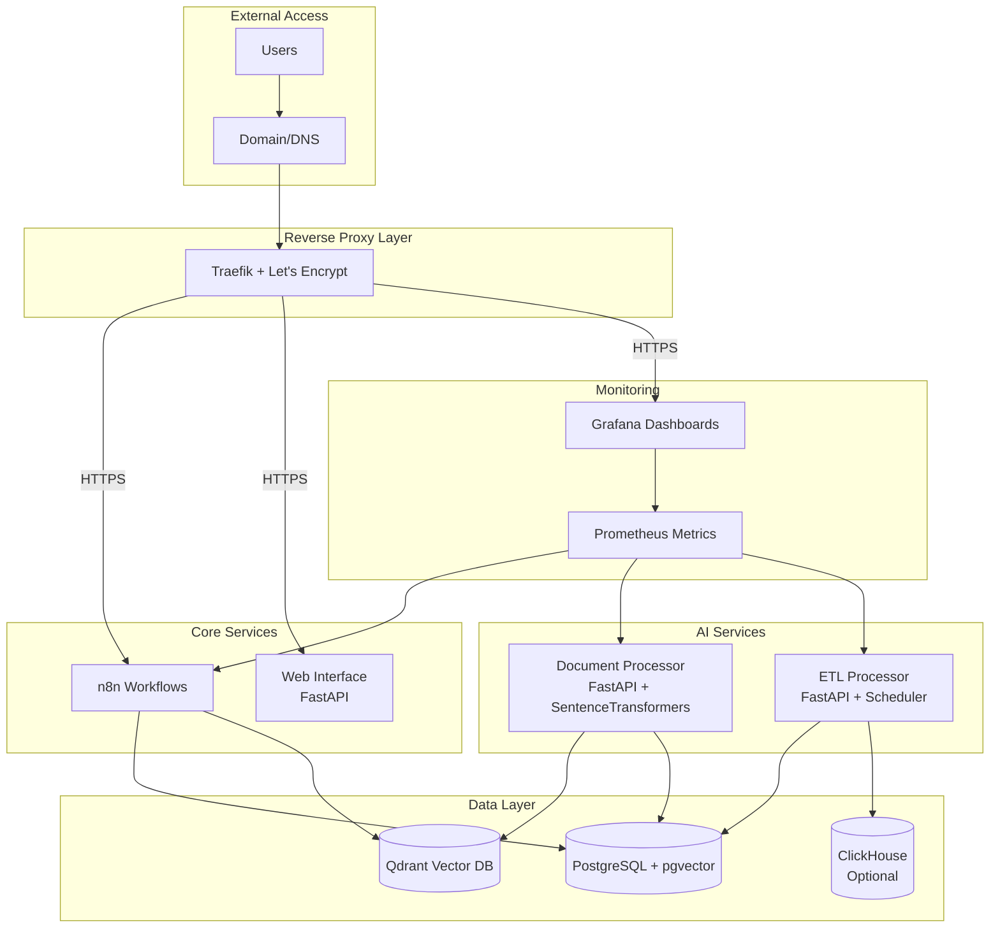
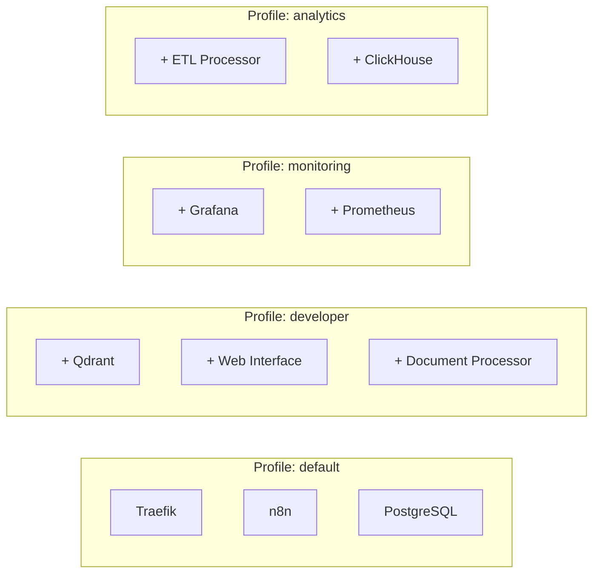
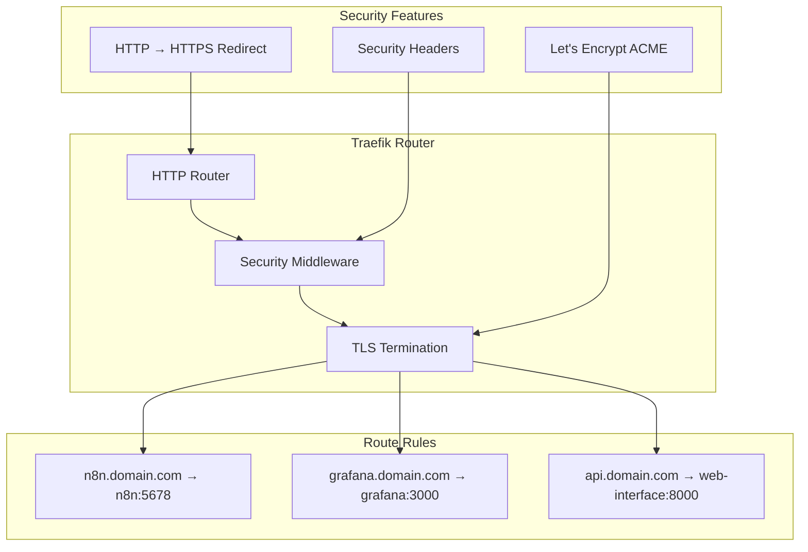
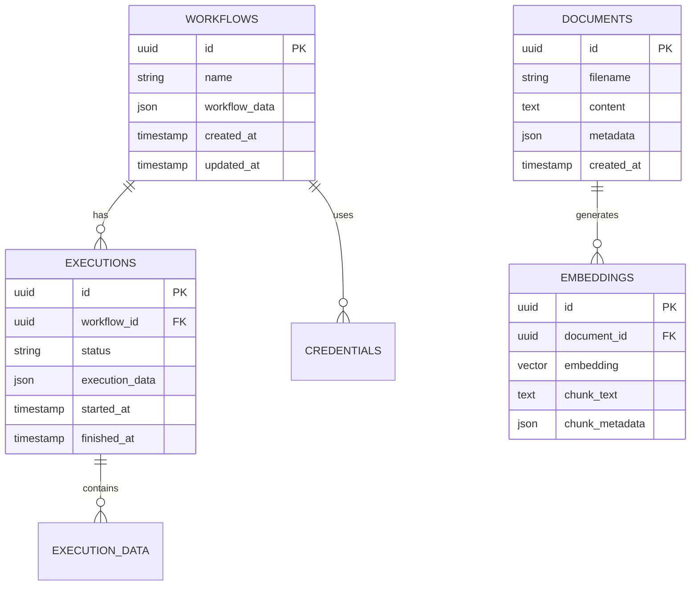
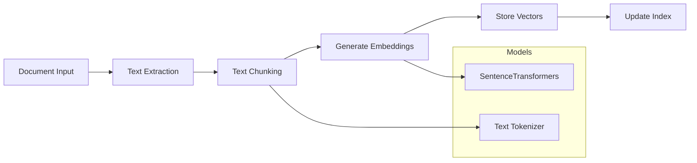
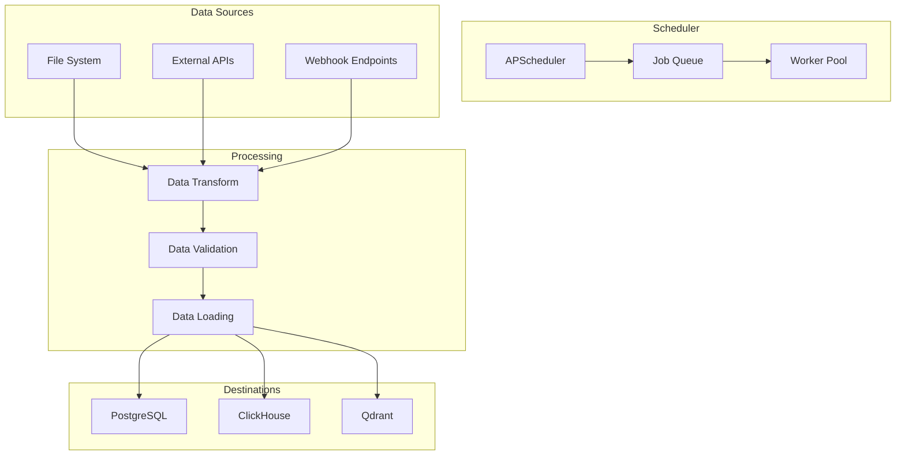
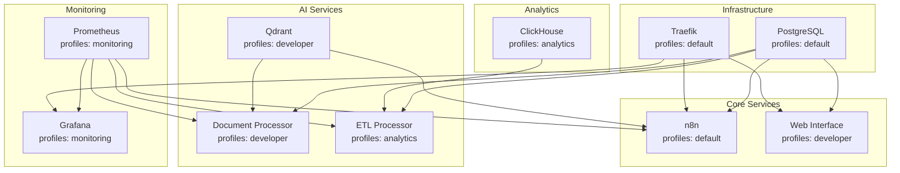
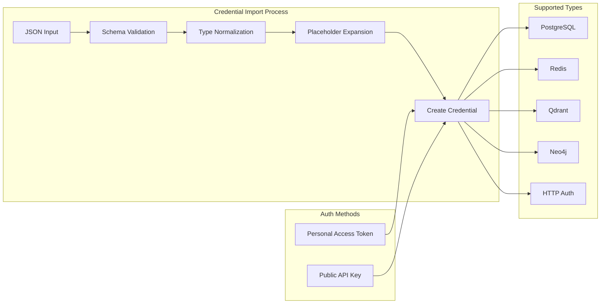
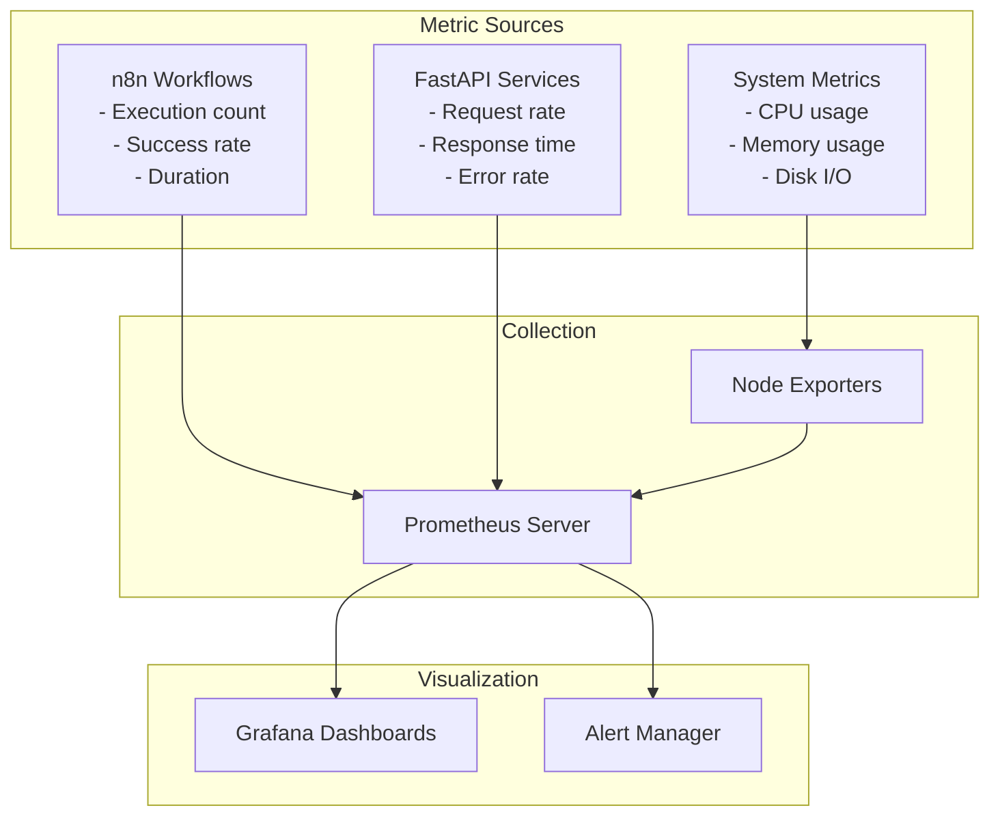

# N8N AI Starter Kit - Technical Design Document

## Overview

N8N AI Starter Kit is a comprehensive DevOps platform that provides a production-ready, containerized environment for deploying n8n automation workflows with integrated AI services. The platform combines workflow automation, vector search capabilities, monitoring, and auxiliary microservices in a single, orchestrated deployment.

**Primary Goals:**
- One-command deployment for both local development and VDS production environments
- Zero-secret repository with templated environment configuration
- Cross-platform compatibility (Linux/Windows with Git Bash support)
- Production-grade security with TLS termination and reverse proxy
- Comprehensive monitoring and observability
- AI-ready infrastructure with vector search and document processing

**Target Users:**
- DevOps engineers setting up automation infrastructure
- Backend developers building AI-powered workflows
- System administrators managing n8n deployments
- Data engineers requiring vector search capabilities

## Architecture

### System Architecture Diagram



### Service Architecture

| Service | Purpose | Technology | Ports | Dependencies |
|---------|---------|------------|-------|--------------|
| Traefik | Reverse Proxy + TLS | Go-based proxy | 80, 443 | - |
| n8n | Workflow Automation | Node.js | 5678 | PostgreSQL |
| PostgreSQL | Primary Database | SQL + pgvector | 5432 | - |
| Qdrant | Vector Search | Rust | 6333 | - |
| Grafana | Monitoring Dashboard | Go | 3000 | Prometheus |
| Prometheus | Metrics Collection | Go | 9090 | - |
| Web Interface | Management UI | FastAPI + Python | 8000 | PostgreSQL |
| Document Processor | AI Document Processing | FastAPI + Python | 8001 | Qdrant, PostgreSQL |
| ETL Processor | Data Pipeline | FastAPI + Python | 8002 | PostgreSQL, ClickHouse |

### Deployment Profiles



## Technology Stack & Dependencies

### Core Infrastructure
- **Container Orchestration**: Docker Compose v2.x
- **Reverse Proxy**: Traefik v3.0 with ACME HTTP-01 challenge
- **TLS/SSL**: Let's Encrypt automatic certificate management
- **Service Discovery**: Docker labels-based routing

### Data Storage
- **Primary Database**: PostgreSQL 15+ with pgvector extension
- **Vector Search**: Qdrant 1.7+ with named Docker volumes
- **Analytics Database**: ClickHouse 23.x (optional, analytics profile)
- **Configuration Storage**: Docker volumes and bind mounts

### Application Services
- **Workflow Engine**: n8n latest stable version
- **API Framework**: FastAPI 0.104+ with Pydantic v2
- **Template Engine**: Jinja2 for web interface
- **ML Framework**: SentenceTransformers for embeddings
- **Task Scheduling**: APScheduler for ETL operations

### Monitoring & Observability
- **Metrics Collection**: Prometheus 2.x
- **Visualization**: Grafana 10.x with provisioned dashboards
- **Health Checks**: Custom health endpoints per service
- **Logging**: Docker logging drivers with log rotation

## Component Architecture

### Traefik Configuration



**Key Features:**
- Automatic SSL certificate provisioning via ACME HTTP-01
- Strict HTTP to HTTPS redirection
- Security headers injection (HSTS, CSP, X-Frame-Options)
- Health check endpoints for all services
- Load balancing and circuit breaker patterns

### N8N Workflow Engine

**Authentication Modes:**
- Personal Access Token (PAT) for REST API
- Public API Key for webhook endpoints
- Basic authentication for web interface

**Integration Points:**
- PostgreSQL for workflow storage and execution history
- REST API endpoints for external service integration
- Webhook receivers for event-driven automation
- Custom credential types for AI service connections

**Credential Management:**
```bash
scripts/create_n8n_credential.sh --type postgres --name "main-db" --data '{"host":"postgres","database":"n8n"}'
scripts/create_n8n_credential.sh --type qdrant --name "vector-db" --data '{"url":"http://qdrant:6333"}'
```

### Data Layer Architecture

#### PostgreSQL + pgvector



**Extensions Enabled:**
- `pgvector` for vector similarity search
- `uuid-ossp` for UUID generation
- `pg_stat_statements` for query performance monitoring

#### Qdrant Vector Database

**Collection Schema:**
```json
{
  "vectors": {
    "size": 384,
    "distance": "Cosine"
  },
  "payload_schema": {
    "document_id": "keyword",
    "source": "keyword", 
    "chunk_index": "integer",
    "metadata": "object"
  }
}
```

**Storage Configuration:**
- Named Docker volume for cross-platform compatibility
- Automatic collection creation via init scripts
- Index optimization for similarity search
- Backup and restore capabilities through volume snapshots

### FastAPI Microservices

#### Web Interface Service (Port 8000)

```mermaid
graph TB
    subgraph "Web Interface"
        Routes[FastAPI Routes]
        Templates[Jinja2 Templates]
        Static[Static Assets]
    end
    
    subgraph "Endpoints"
        Health[/health]
        Status[/status]
        UI[/ui/*]
        API[/api/v1/*]
    end
    
    subgraph "Features"
        Auth[Authentication]
        CORS[CORS Middleware]
        Docs[OpenAPI Docs]
    end
    
    Routes --> Health
    Routes --> Status
    Routes --> UI
    Routes --> API
    
    Templates --> UI
    Static --> UI
    Auth --> API
    CORS --> Routes
    Docs --> Routes
```

**Core Endpoints:**
- `GET /health` - Service health check
- `GET /status` - Detailed system status
- `GET /ui/dashboard` - Management dashboard
- `POST /api/v1/workflows/trigger` - Workflow execution trigger
- `GET /api/v1/documents/search` - Document search interface

#### Document Processor Service (Port 8001)

**Processing Pipeline:**


**Key Features:**
- Multi-format document processing (PDF, DOCX, TXT, MD)
- Configurable chunking strategies (sentence, paragraph, token-based)
- Embedding model management with model warming
- Batch processing for large document sets
- Vector storage in both Qdrant and PostgreSQL

#### ETL Processor Service (Port 8002)

**Scheduling Architecture:**


## Environment Configuration & Security

### Environment Schema

```bash
# Core Services
N8N_HOST=localhost
N8N_PORT=5678
N8N_PROTOCOL=https

POSTGRES_HOST=postgres
POSTGRES_PORT=5432
POSTGRES_DB=n8n
POSTGRES_USER=n8n_user
POSTGRES_PASSWORD=change_this_secure_password_123

# Vector Database
QDRANT_HOST=qdrant
QDRANT_PORT=6333
QDRANT_API_KEY=change_this_qdrant_key_456

# Monitoring
GRAFANA_HOST=grafana
GRAFANA_PORT=3000
GRAFANA_ADMIN_USER=admin
GRAFANA_ADMIN_PASSWORD=change_this_grafana_password_789

# Domain Configuration
DOMAIN=localhost
N8N_DOMAIN=n8n.${DOMAIN}
GRAFANA_DOMAIN=grafana.${DOMAIN}
API_DOMAIN=api.${DOMAIN}

# TLS Configuration
ACME_EMAIL=admin@${DOMAIN}
TRAEFIK_LOG_LEVEL=INFO

# Compose Profiles
COMPOSE_PROFILES=default,developer,monitoring
```

### Security Implementation

**Template-based Environment Generation:**
```bash
#!/bin/bash
# scripts/setup.sh
set -euo pipefail

copy_template() {
    cp template.env .env
    echo "✓ Created .env from template"
}

generate_passwords() {
    local postgres_password=$(openssl rand -base64 32)
    local qdrant_key=$(openssl rand -hex 32)
    local grafana_password=$(openssl rand -base64 24)
    
    sed -i "s/change_this_secure_password_123/${postgres_password}/g" .env
    sed -i "s/change_this_qdrant_key_456/${qdrant_key}/g" .env
    sed -i "s/change_this_grafana_password_789/${grafana_password}/g" .env
}

validate_env() {
    if ! command -v envsubst >/dev/null 2>&1; then
        echo "Error: envsubst not available"
        exit 1
    fi
    
    envsubst < .env > /dev/null
    echo "✓ Environment validation passed"
}
```

**Security Features:**
- No secrets committed to repository
- Strong password generation using OpenSSL
- Environment variable validation
- Placeholder-based secret management
- Cross-platform compatibility (Windows/Linux)

## Docker Compose Configuration

### Service Dependencies



### Volume Management

**Named Volumes (Cross-platform):**
```yaml
volumes:
  postgres_data:
    driver: local
  qdrant_data:
    driver: local
  grafana_data:
    driver: local
  prometheus_data:
    driver: local
  clickhouse_data:
    driver: local
```

**Bind Mounts (Development):**
```yaml
# Development overrides
services:
  web-interface:
    volumes:
      - ./services/web-interface:/app
      - /app/node_modules
  
  document-processor:
    volumes:
      - ./services/document-processor:/app
      - /app/.venv
```

### Health Checks

```yaml
healthcheck:
  test: ["CMD", "curl", "-f", "http://localhost:8000/health"]
  interval: 30s
  timeout: 10s
  retries: 3
  start_period: 40s
```

## API Integration Layer

### N8N Credential Management



**Credential Creation Script:**
```bash
#!/bin/bash
# scripts/create_n8n_credential.sh

authenticate() {
    if [[ -n "${N8N_API_KEY:-}" ]]; then
        auth_header="X-N8N-API-KEY: ${N8N_API_KEY}"
    elif [[ -n "${N8N_PERSONAL_ACCESS_TOKEN:-}" ]]; then
        auth_header="Authorization: Bearer ${N8N_PERSONAL_ACCESS_TOKEN}"
    else
        echo "Error: No authentication method configured"
        exit 1
    fi
}

normalize_credential_type() {
    local type="$1"
    case "$type" in
        postgres|postgresql) echo "postgres" ;;
        redis) echo "redis" ;;
        qdrant) echo "qdrant" ;;
        neo4j) echo "neo4j" ;;
        *) echo "$type" ;;
    esac
}

expand_placeholders() {
    local data="$1"
    # Expand environment variables in credential data
    echo "$data" | envsubst
}

create_credential() {
    local name="$1"
    local type="$2"
    local data="$3"
    
    local normalized_type=$(normalize_credential_type "$type")
    local expanded_data=$(expand_placeholders "$data")
    
    local payload=$(jq -n \
        --arg name "$name" \
        --arg type "$normalized_type" \
        --argjson data "$expanded_data" \
        '{name: $name, type: $type, data: $data}')
    
    curl -X POST \
        -H "Content-Type: application/json" \
        -H "$auth_header" \
        -d "$payload" \
        "${N8N_BASE_URL}/api/v1/credentials"
}
```

### Cross-Service Communication

**Service Discovery:**
```yaml
# Docker Compose networking
networks:
  n8n-network:
    driver: bridge
    ipam:
      config:
        - subnet: 172.20.0.0/16
```

**Internal API Endpoints:**
- `http://postgres:5432` - Database connections
- `http://qdrant:6333` - Vector search API
- `http://web-interface:8000` - Management interface
- `http://document-processor:8001` - Document processing
- `http://etl-processor:8002` - ETL operations

## Monitoring Strategy

### Prometheus Metrics



### Grafana Dashboards

**Dashboard Configuration:**
```json
{
  "dashboard": {
    "id": null,
    "title": "N8N AI Starter Kit Overview",
    "tags": ["n8n", "ai", "automation"],
    "timezone": "browser",
    "panels": [
      {
        "title": "Workflow Execution Rate",
        "type": "stat",
        "targets": [
          {
            "expr": "rate(n8n_workflow_executions_total[5m])",
            "legendFormat": "Executions/sec"
          }
        ]
      },
      {
        "title": "Service Health Status",
        "type": "table",
        "targets": [
          {
            "expr": "up{job=~\"n8n|qdrant|postgres|.*-processor\"}",
            "legendFormat": "{{instance}}"
          }
        ]
      }
    ]
  }
}
```

**Provisioned Dashboards:**
- N8N Workflow Performance
- System Resource Usage
- API Service Metrics
- Vector Database Performance
- ETL Pipeline Status

## Testing

### Unit Testing Strategy

**FastAPI Services Testing:**
```python
# tests/test_document_processor.py
import pytest
from fastapi.testclient import TestClient
from services.document_processor.main import app

client = TestClient(app)

def test_health_endpoint():
    response = client.get("/health")
    assert response.status_code == 200
    assert response.json()["status"] == "healthy"

def test_document_upload():
    files = {"file": ("test.txt", "Sample document content", "text/plain")}
    response = client.post("/api/v1/documents/upload", files=files)
    assert response.status_code == 201
    assert "document_id" in response.json()

@pytest.mark.asyncio
async def test_embedding_generation():
    from services.document_processor.embeddings import generate_embeddings
    text = "Sample text for embedding"
    embeddings = await generate_embeddings(text)
    assert len(embeddings) == 384  # SentenceTransformers default dimension
```

### Integration Testing

**Docker Compose Validation:**
```bash
#!/bin/bash
# scripts/test-integration.sh

test_service_health() {
    local service="$1"
    local port="$2"
    local endpoint="${3:-/health}"
    
    echo "Testing $service health..."
    if curl -f "http://localhost:$port$endpoint" >/dev/null 2>&1; then
        echo "✓ $service is healthy"
        return 0
    else
        echo "✗ $service health check failed"
        return 1
    fi
}

test_n8n_connectivity() {
    echo "Testing n8n API connectivity..."
    local response=$(curl -s -H "Authorization: Bearer $N8N_PERSONAL_ACCESS_TOKEN" \
        "http://localhost:5678/api/v1/workflows")
    
    if echo "$response" | jq -e '.data' >/dev/null 2>&1; then
        echo "✓ n8n API is accessible"
        return 0
    else
        echo "✗ n8n API test failed"
        return 1
    fi
}

test_vector_search() {
    echo "Testing Qdrant vector search..."
    local response=$(curl -s "http://localhost:6333/collections")
    
    if echo "$response" | jq -e '.result' >/dev/null 2>&1; then
        echo "✓ Qdrant is accessible"
        return 0
    else
        echo "✗ Qdrant test failed"
        return 1
    fi
}

main() {
    test_service_health "web-interface" 8000 || exit 1
    test_service_health "document-processor" 8001 || exit 1
    test_service_health "etl-processor" 8002 || exit 1
    test_n8n_connectivity || exit 1
    test_vector_search || exit 1
    
    echo "✓ All integration tests passed"
}
```

### Compose Validation

**Lint Configuration:**
```bash
#!/bin/bash
# scripts/compose-lint.sh

validate_compose_syntax() {
    echo "Validating Docker Compose syntax..."
    docker compose config >/dev/null 2>&1
    if [[ $? -eq 0 ]]; then
        echo "✓ Compose syntax is valid"
    else
        echo "✗ Compose syntax validation failed"
        exit 1
    fi
}

check_service_dependencies() {
    echo "Checking service dependencies..."
    local services=$(docker compose config --services)
    
    for service in $services; do
        local depends_on=$(docker compose config | yq eval ".services.$service.depends_on // []" -)
        if [[ "$depends_on" != "[]" ]]; then
            echo "✓ $service has proper dependencies"
        fi
    done
}

validate_healthchecks() {
    echo "Validating health checks..."
    local services_with_healthchecks=$(docker compose config | yq eval '.services | to_entries | map(select(.value.healthcheck)) | .[].key' -)
    
    if [[ -n "$services_with_healthchecks" ]]; then
        echo "✓ Health checks configured for: $services_with_healthchecks"
    else
        echo "⚠ No health checks found"
    fi
}
```