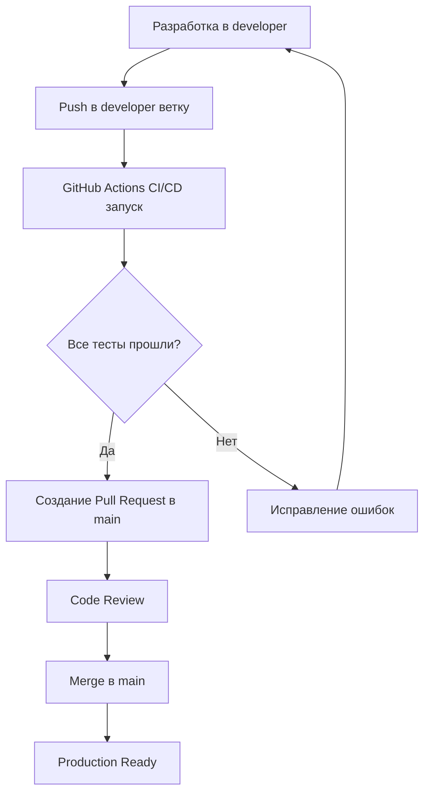

# 🌿 Стратегия веток и CI/CD процесс

## ✅ Что настроено

### 🔧 Структура веток:
- **`main`** - Продакшн-ветка (стабильная)
- **`developer`** - Ветка разработки и тестирования

### 🚀 GitHub Actions Workflows:

#### 1. **Comprehensive Testing Pipeline** (`test.yml`)
Запускается при push в `main`, `develop`, `developer`:
- ✅ Profile Configuration Validation
- ✅ Unit Tests (Python/pytest)
- ✅ Integration Tests
- ✅ Service Startup Tests (Matrix testing)
- ✅ Security & Audit Tests
- ✅ Comprehensive Report Generation

#### 2. **Docker Build & Deploy** (`deploy.yml`)
Запускается при push в `main`, `developer`:
- ✅ Multi-service Docker image builds
- ✅ GitHub Container Registry push
- ✅ Staging deployment testing
- ✅ Production deployment (только для tags)

#### 3. **Performance Testing** (`performance.yml`)
Еженедельное и ручное тестирование производительности

### 📋 Process Flow:



## 🎯 Рабочий процесс

### Этап 1: Разработка
```bash
# Переключение на developer ветку
git checkout developer

# Внесение изменений
# ... ваши изменения ...

# Commit и push
git add .
git commit -m "feat: описание изменений"
git push origin developer
```

### Этап 2: Автоматическое тестирование
GitHub Actions автоматически запустит все тесты в ветке `developer`

### Этап 3: Мониторинг результатов
Проверка статуса: https://github.com/sattva2020/N8N-AI-Starter-Kit-Advanced/actions

### Этап 4: Pull Request (после успешных тестов)
1. Создание PR из `developer` в `main`
2. Заполнение PR template с результатами
3. Code review и merge

## 📊 Ожидаемые результаты тестирования

После push в `developer` ожидайте:

✅ **Profile Configuration Validation**
- Валидация всех Docker Compose профилей
- Проверка конфигурационных зависимостей

✅ **Unit Tests**  
- Python pytest тесты для всех сервисов
- Проверка API endpoints и бизнес-логики

✅ **Integration Tests**
- Тестирование межсервисного взаимодействия
- Проверка health endpoints

✅ **Service Startup Tests**
- Matrix тестирование различных профилей:
  - `default`
  - `default,developer`
  - `default,monitoring` 
  - `default,developer,monitoring`

✅ **Security & Audit Tests**
- Проверка на hardcoded secrets
- Валидация Docker конфигураций

## 🔍 Локальное тестирование

Перед push рекомендуется:

```bash
# Быстрое тестирование профилей
./scripts/test-profiles.sh basic --verbose

# Полное комплексное тестирование
./scripts/run-comprehensive-tests.sh all

# Мониторинг системы
./scripts/advanced-monitor.sh check
```

## 🎉 Преимущества этого подхода

- 🛡️ **Безопасность**: main ветка защищена от сломанного кода
- ⚡ **Скорость**: быстрая разработка в developer ветке
- 🧪 **Качество**: комплексное автоматическое тестирование
- 📊 **Видимость**: полная трассируемость изменений
- 🔄 **Гибкость**: возможность быстрого отката

---

**Все готово для продуктивной разработки! 🚀**

Следующие изменения теперь тестируются в безопасной среде `developer` ветки перед продакшном.