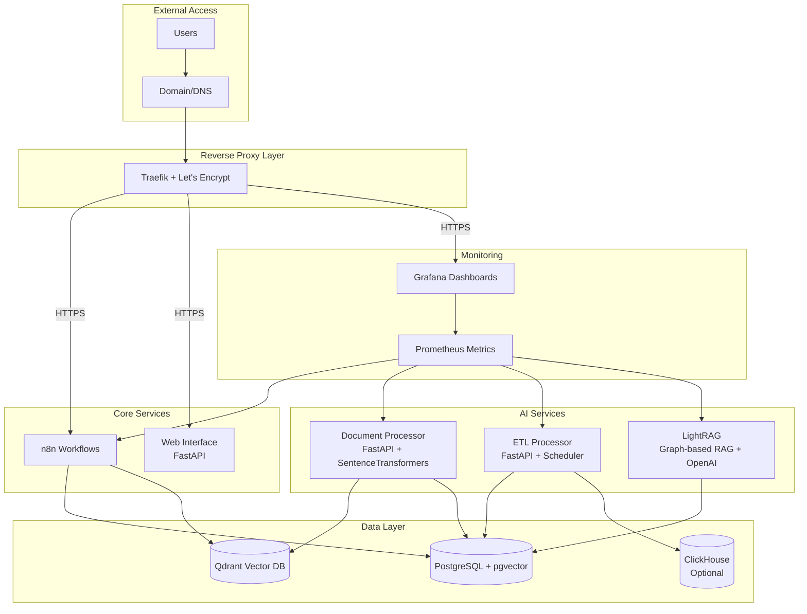

# N8N AI Starter Kit

[](https://opensource.org/licenses/MIT)
[](https://www.docker.com/)
[](https://n8n.io/)

A production-ready, containerized N8N deployment with integrated AI services, vector search capabilities, monitoring, and auxiliary microservices. Deploy a complete workflow automation platform with one command.

## 🚀 Quick Start

### Prerequisites

- **Docker & Docker Compose** (v2.x recommended)
- **Git** (for cloning the repository)
- **Bash** (Linux/macOS) or **Git Bash** (Windows)

### One-Command Deployment

```bash
# Clone the repository
git clone https://github.com/your-org/n8n-ai-starter-kit.git
cd n8n-ai-starter-kit

# Setup environment and start services
./start.sh
```

That's it! The setup script will:
1. Generate secure passwords and API keys
2. Create environment configuration
3. Start all services with Docker Compose
4. Display service URLs and credentials

## 📋 What's Included

### Core Services

| Service | Purpose | URL | Port |
|---------|---------|-----|------|
| **N8N** | Workflow Automation Engine | https://n8n.localhost | 5678 |
| **Traefik** | Reverse Proxy + TLS | https://traefik.localhost | 80, 443 |
| **PostgreSQL** | Primary Database (+ pgvector) | - | 5432 |
| **Grafana** | Monitoring Dashboard | https://grafana.localhost | 3000 |
| **Qdrant** | Vector Search Database | - | 6333 |

### AI Services

| Service | Purpose | URL | Port |
|---------|---------|-----|------|
| **Web Interface** | Management Dashboard | https://api.localhost/ui | 8000 |
| **Document Processor** | AI Document Processing | https://api.localhost/docs | 8001 |
| **ETL Processor** | Data Pipeline & Analytics | https://api.localhost/etl | 8002 |
| **LightRAG** | Graph-based RAG System | https://api.localhost/lightrag | 8003 |

### Management Tools

| Tool | Purpose | Location |
|------|---------|----------|
| **Credential Manager** | Enhanced N8N credential management with pagination | `scripts/create_n8n_credential.sh` |
| **Execution Monitor** | Real-time workflow execution monitoring | `scripts/n8n-execution-monitor.sh` |
| **Workflow Manager** | Complete workflow lifecycle management | `scripts/n8n-workflow-manager.sh` |
| **Security Monitor** | Integrated security auditing and monitoring | `scripts/maintenance/monitor.sh` |

### Optional Services

| Service | Purpose | Profile | Port |
|---------|---------|---------|------|
| **ClickHouse** | Analytics Database | analytics | 8123 |
| **Prometheus** | Metrics Collection | monitoring | 9090 |

## 🏗️ Architecture Overview



## 🔧 Configuration

### Environment Profiles

Choose which services to run with Docker Compose profiles:

```bash
# Core services only (minimal deployment)
./start.sh --profile default

# Development setup (recommended)
./start.sh --profile default,developer,monitoring

# Full analytics stack
./start.sh --profile default,developer,monitoring,analytics
```

### Profile Breakdown

- **`default`**: Traefik, N8N, PostgreSQL
- **`developer`**: + Qdrant, Web Interface, Document Processor, LightRAG
- **`monitoring`**: + Grafana, Prometheus
- **`analytics`**: + ETL Processor, ClickHouse
- **`gpu`**: + GPU-accelerated AI services with local models

### Environment Configuration

All configuration is managed through environment variables. The setup script generates a secure `.env` file automatically.

Key variables you might want to customize:

```bash
# Domain configuration (change for production)
DOMAIN=localhost
ACME_EMAIL=admin@yourdomain.com

# Service profiles
COMPOSE_PROFILES=default,developer,monitoring

# AI/ML settings
DOC_PROCESSOR_MODEL=sentence-transformers/all-MiniLM-L6-v2
CHUNK_SIZE=500
CHUNK_OVERLAP=50

# LightRAG settings
OPENAI_API_KEY=your_openai_api_key_here
LIGHTRAG_LLM_MODEL=gpt-4o-mini
LIGHTRAG_EMBEDDING_MODEL=text-embedding-3-small

# GPU settings (for gpu profile)
GPU_TYPE=auto
CUDA_VISIBLE_DEVICES=0
```

## 📊 Management and Monitoring

### Enhanced N8N API Tools

The kit includes enhanced management scripts with full N8N API integration:

#### Credential Management
```bash
# Enhanced credential management with pagination and API integration
./scripts/create_n8n_credential.sh --list --limit 50
./scripts/create_n8n_credential.sh --list --all  # Get all pages
./scripts/create_n8n_credential.sh --get-schema githubApi
./scripts/create_n8n_credential.sh --list-types
./scripts/create_n8n_credential.sh --bulk credentials.json  # Mass creation

# Create PostgreSQL credential
./scripts/create_n8n_credential.sh --type postgres --name "main-db" \
  --data '{"host":"postgres","port":5432,"database":"n8n","username":"user","password":"pass"}'
```

#### Workflow Management
```bash
# Complete workflow lifecycle management
./scripts/n8n-workflow-manager.sh --list --active
./scripts/n8n-workflow-manager.sh --activate workflow_123
./scripts/n8n-workflow-manager.sh --export workflow_123 backup.json
./scripts/n8n-workflow-manager.sh --duplicate workflow_123
./scripts/n8n-workflow-manager.sh --health  # Check workflow health
```

#### Execution Monitoring
```bash
# Real-time execution monitoring with advanced filtering
./scripts/n8n-execution-monitor.sh --watch
./scripts/n8n-execution-monitor.sh --stats
./scripts/n8n-execution-monitor.sh --workflow workflow_123
./scripts/n8n-execution-monitor.sh --status error  # Filter by status
./scripts/n8n-execution-monitor.sh --export executions.json
./scripts/n8n-execution-monitor.sh --analytics  # Performance analytics
```

#### System Monitoring
```bash
# Comprehensive system monitoring with security audit
./scripts/maintenance/monitor.sh                    # All checks
./scripts/maintenance/monitor.sh health             # Service health
./scripts/maintenance/monitor.sh security           # Security audit
./scripts/maintenance/monitor.sh performance        # Performance metrics
./scripts/maintenance/monitor.sh --format json      # JSON output
```

#### Testing Infrastructure
```bash
# Comprehensive testing with Playwright E2E
./scripts/run-comprehensive-tests.sh               # All tests
./scripts/run-comprehensive-tests.sh e2e           # End-to-end tests
./scripts/run-comprehensive-tests.sh api           # API tests
./scripts/run-comprehensive-tests.sh security      # Security tests
```

#### Workflow Management
```bash
# Complete workflow lifecycle management
./scripts/n8n-workflow-manager.sh --list --active
./scripts/n8n-workflow-manager.sh --health
./scripts/n8n-workflow-manager.sh --performance
```

#### Security Auditing
```bash
# Integrated security monitoring
./scripts/maintenance/monitor.sh security
./scripts/maintenance/monitor.sh all  # includes security audit
```

📚 **Detailed API Documentation**: See [`docs/N8N-API-ENHANCEMENTS.md`](docs/N8N-API-ENHANCEMENTS.md) for comprehensive API usage guides.

### System Monitoring

Built-in monitoring stack with Grafana dashboards:

```bash
# System health checks
./scripts/maintenance/monitor.sh health

# Performance monitoring
./scripts/maintenance/monitor.sh performance

# Log analysis
./scripts/maintenance/monitor.sh logs --days 7

# Complete monitoring suite
./scripts/maintenance/monitor.sh all
```

## 🚀 GPU Acceleration

The kit supports GPU acceleration for AI workloads with NVIDIA and AMD hardware:

### Automatic GPU Detection

```bash
# Run GPU detection script
./scripts/detect-gpu.sh

# Force NVIDIA detection
./scripts/detect-gpu.sh --nvidia

# Force AMD detection  
./scripts/detect-gpu.sh --amd

# Run GPU benchmark
./scripts/detect-gpu.sh --benchmark
```

### GPU Requirements

**NVIDIA GPUs:**
- CUDA 11.8+ compatible GPU (RTX 20xx/30xx/40xx, Tesla, A100, etc.)
- NVIDIA Docker runtime installed
- 8GB+ VRAM recommended for local models

**AMD GPUs:**
- ROCm 5.4+ compatible GPU (RX 6000+, MI series)
- ROCm Docker support
- Experimental support

### GPU Services

When using the `gpu` profile, these services become available:

- **document-processor-gpu** (port 8011): GPU-accelerated document processing
- **lightrag-gpu** (port 8013): Local AI models with GPU acceleration  
- **gpu-monitor** (port 8014): Real-time GPU monitoring and management
- **ollama** (port 11434): Local LLM server for running models offline

### Starting with GPU Support

```bash
# Auto-detect and start with GPU
./start.sh --profile default,developer,gpu

# Check GPU status
curl http://localhost:8014/gpu/info

# Monitor GPU usage
docker logs n8n-gpu-monitor
```

### Local AI Models

The GPU profile enables running local AI models:

```bash
# Use local models instead of OpenAI API
curl -X POST "http://localhost:8013/query" \
  -H "Content-Type: application/json" \
  -d '{"query": "Explain machine learning", "use_local": true}'
```

### Ollama Integration

Ollama provides easy local LLM deployment:

```bash
# Check available models
curl http://localhost:8013/models

# Pull a new model (e.g., Llama 2)
curl -X POST "http://localhost:8013/models/pull?model_name=llama2:13b"

# Switch to local models
# Set MODEL_PROVIDER=ollama in .env file
```

**Popular Ollama Models:**
- `llama3.3:8b` - Latest general purpose, 4GB VRAM
- `llama3.2:1b` - Ultra-fast responses, <1GB VRAM
- `qwen2.5-coder:7b` - Advanced code generation, 4GB VRAM
- `codellama:7b` - Meta's code specialist, 4GB VRAM
- `mistral-nemo:12b` - Long context (128k), 8GB VRAM
- `neumind-math:7b` - Mathematical reasoning, 4GB VRAM
- `nomic-embed-text` - Embeddings, <1GB VRAM

### Performance Benefits

- **10-100x faster** embedding generation
- **Local model inference** without API costs
- **Batch processing** of large document sets
- **Real-time responses** for complex queries
```

## 🛠️ Usage Guide

### Starting and Stopping

```bash
# Start all services
./start.sh

# Start in background
./start.sh --detach

# Start specific profiles
./start.sh --profile default,monitoring

# Stop services
./start.sh down

# Restart services
./start.sh restart

# View service status
./start.sh status

# Follow logs
./start.sh logs --follow n8n
```

### Service Management

```bash
# View real-time service status
./start.sh status

# Check system health
./scripts/maintenance/monitor.sh health

# View performance metrics
./scripts/maintenance/monitor.sh performance

# Analyze logs for errors
./scripts/maintenance/monitor.sh logs --days 7
```

### N8N Credential Management

The kit includes powerful automated credential management for N8N:

```bash
# Automatic setup for all services during startup
./start.sh up  # Credentials created automatically

# Manual credential setup
./start.sh setup-credentials

# Advanced credential management
python3 scripts/credential-manager.py --interactive

# Automated setup for specific services
./scripts/auto-setup-credentials.sh --services postgres,qdrant,openai

# List existing credentials
./scripts/create_n8n_credential.sh --list
```

**Supported Services:**
- `postgres` - Main PostgreSQL database
- `qdrant` - Vector database for AI embeddings
- `openai` - OpenAI API for GPT models
- `ollama` - Local LLM server
- `redis` - Cache database
- `neo4j` - Graph database
- `clickhouse` - Analytics database
- `grafana` - Monitoring dashboard

**Authentication Setup:**
1. Start N8N: `./start.sh up`
2. Open N8N: `https://n8n.localhost`
3. Go to Settings → Personal Access Token
4. Create token and add to `.env`: `N8N_PERSONAL_ACCESS_TOKEN=your-token`
5. Run: `./start.sh setup-credentials`

For detailed documentation, see [CREDENTIAL-MANAGEMENT.md](docs/CREDENTIAL-MANAGEMENT.md)

### Document Processing

Upload and process documents using the AI services:

```bash
# Upload document via API
curl -X POST "http://localhost:8001/docs/upload" \
  -H "Content-Type: multipart/form-data" \
  -F "file=@document.pdf"

# Search documents with natural language
curl -X POST "http://localhost:8001/docs/search" \
  -H "Content-Type: application/json" \
  -d '{"query": "machine learning concepts", "limit": 5}'
```

### LightRAG Knowledge Graph

Use LightRAG for graph-based document analysis:

```bash
# Ingest document into knowledge graph
curl -X POST "http://localhost:8003/documents/ingest" \
  -H "Content-Type: application/json" \
  -d '{
    "content": "Your document content here...",
    "metadata": {"source": "example.txt"},
    "source": "example.txt"
  }'

# Query the knowledge graph
curl -X POST "http://localhost:8003/query" \
  -H "Content-Type: application/json" \
  -d '{
    "query": "What are the main concepts in the documents?",
    "mode": "hybrid"
  }'

# Upload file to knowledge graph
curl -X POST "http://localhost:8003/documents/ingest-file" \
  -F "file=@document.txt"
```

### Backup and Restore

```bash
# Create full backup
./scripts/maintenance/backup.sh

# Create backup of specific services
./scripts/maintenance/backup.sh --services postgres,qdrant

# List available backups
./scripts/maintenance/restore.sh list

# Restore from latest backup
./scripts/maintenance/restore.sh latest

# Restore specific backup
./scripts/maintenance/restore.sh restore backup_20240101_120000.tar.gz
```

## 🔐 Security

### Default Security Features

- **Automatic TLS**: Let's Encrypt certificates via Traefik
- **Secure Passwords**: Auto-generated strong passwords
- **Network Isolation**: Services in isolated Docker network
- **Security Headers**: HSTS, CSP, X-Frame-Options
- **No Secrets in Code**: Template-based environment generation

### Production Security Checklist

- [ ] Change default domain from `localhost`
- [ ] Configure proper DNS for your domain
- [ ] Set up firewall rules (only ports 80, 443 exposed)
- [ ] Enable N8N authentication
- [ ] Set up backup encryption
- [ ] Configure log rotation
- [ ] Set up monitoring alerts
- [ ] Review and rotate secrets regularly

### Authentication

N8N supports multiple authentication methods:

```bash
# Set Personal Access Token
export N8N_PERSONAL_ACCESS_TOKEN="your-token-here"

# Or use API Key
export N8N_API_KEY="your-api-key-here"
```

## 📊 Monitoring

### Grafana Dashboards

Access Grafana at `https://grafana.localhost` with:
- **Username**: `admin` 
- **Password**: Check `.env` file for `GRAFANA_ADMIN_PASSWORD`

Pre-configured dashboards include:
- N8N workflow execution metrics
- System resource monitoring  
- Document processing analytics
- Service health overview

### Prometheus Metrics

Direct access to metrics:
- Prometheus: `http://localhost:9090`
- Service metrics: `http://localhost:PORT/metrics`

### Health Monitoring

```bash
# Complete health check
./scripts/maintenance/monitor.sh

# Check specific aspects
./scripts/maintenance/monitor.sh health
./scripts/maintenance/monitor.sh performance  
./scripts/maintenance/monitor.sh disk --threshold 90
./scripts/maintenance/monitor.sh network
```

## 🧪 Development

### Local Development Setup

```bash
# Start with development profile
./start.sh --profile default,developer

# Enable debug mode in services
echo "DEBUG=true" >> .env
./start.sh restart

# Follow service logs
./start.sh logs --follow document-processor
```

### Custom Service Development

The kit supports custom FastAPI services. See `services/` directory for examples.

### Testing

```bash
# Run comprehensive test suite
./scripts/run-comprehensive-tests.sh

# Test specific components
./scripts/run-comprehensive-tests.sh unit           # Unit tests
./scripts/run-comprehensive-tests.sh integration   # Integration tests
./scripts/run-comprehensive-tests.sh profiles      # Profile validation
./scripts/run-comprehensive-tests.sh e2e           # End-to-end tests

# Run service health checks
./scripts/maintenance/monitor.sh health

# Test document processing
curl -X POST "http://localhost:8001/health"

# Test web interface
curl -X GET "http://localhost:8000/health"
```

#### Profile Testing

The kit includes comprehensive testing for all Docker Compose deployment profiles:

```bash
# Test basic profile configurations
./scripts/test-profiles.sh basic --dry-run

# Test all possible profile combinations
./scripts/test-profiles.sh extended --dry-run

# Test GPU profiles (if GPU available)
./scripts/test-profiles.sh gpu --verbose

# Test production-recommended profiles
./scripts/test-profiles.sh production

# Test specific profile combination
./scripts/test-profiles.sh custom "default,monitoring"

# Test with actual service startup
./scripts/test-profiles.sh basic --with-startup --timeout 300
```

**Profile validation includes:**
- ✅ Docker Compose configuration validation
- ✅ Service dependency checking
- ✅ Health endpoint verification
- ✅ Profile-specific requirements validation
- ✅ Startup and shutdown testing

📚 **Detailed Testing Guide**: See [`docs/PROFILE-TESTING.md`](docs/PROFILE-TESTING.md) for comprehensive testing documentation.

#### Advanced Operations

For production deployments, the kit includes advanced operational features:

```bash
# Advanced monitoring with alerting
./scripts/advanced-monitor.sh start --daemon --webhook https://hooks.slack.com/...

# Automated backup with encryption
./scripts/backup-disaster-recovery.sh backup --verify --encrypt

# Complete CI/CD pipeline testing
./scripts/run-comprehensive-tests.sh all --verbose
```

**Advanced Features:**
- 🚀 **CI/CD Integration**: GitHub Actions workflows for automated testing and deployment
- 📊 **Advanced Monitoring**: Real-time metrics, alerting, and dashboard
- 💾 **Disaster Recovery**: Comprehensive backup and restore capabilities
- ⚡ **Performance Testing**: Automated load and stress testing with K6
- 🔒 **Security Compliance**: Automated security auditing and compliance checks

📚 **Advanced Operations Guide**: See [`docs/ADVANCED-OPERATIONS.md`](docs/ADVANCED-OPERATIONS.md) for comprehensive operational documentation.

## 🌍 Deployment

### Local Development

```bash
# Quick start for development
./start.sh --profile default,developer
```

### VDS/Cloud Deployment

1. **Setup Domain**: Configure DNS to point to your server
2. **Update Environment**: Set `DOMAIN` and `ACME_EMAIL` in `.env`
3. **Configure Firewall**: Allow ports 80 and 443
4. **Start Services**:
   ```bash
   ./start.sh --profile default,developer,monitoring --detach
   ```

### Production Deployment

1. **Security Review**: Complete the security checklist above
2. **Backup Strategy**: Set up automated backups
3. **Monitoring**: Configure alerts in Grafana
4. **SSL/TLS**: Verify automatic certificate generation
5. **Performance**: Monitor resource usage and scale as needed

## 📁 Directory Structure

```
n8n-ai-starter-kit/
├── docker-compose.yml          # Main composition file
├── start.sh                    # Primary startup script
├── template.env                # Environment template
├── env.schema                  # Environment documentation
├── scripts/                    
│   ├── setup.sh               # Environment setup
│   ├── create_n8n_credential.sh # Credential management
│   └── maintenance/           
│       ├── backup.sh          # Backup utilities
│       ├── restore.sh         # Restore utilities
│       └── monitor.sh         # Health monitoring
├── services/                   # FastAPI microservices
│   ├── web-interface/         # Management dashboard
│   ├── document-processor/    # AI document processing
│   ├── etl-processor/         # Data pipelines
│   └── lightrag/              # Graph-based RAG system
├── config/                     # Service configurations
│   ├── grafana/               # Grafana setup
│   ├── prometheus/            # Prometheus config
│   ├── postgres/              # Database init scripts
│   └── clickhouse/            # ClickHouse setup
├── docs/                      # Additional documentation
├── ai-instructions/           # AI agent instructions
└── project.md                 # Technical overview
```

## 🔧 Troubleshooting

### Common Issues

#### Services Not Starting

```bash
# Check Docker daemon
docker version

# Check compose configuration
docker compose config

# View service logs
./start.sh logs
```

#### SSL Certificate Issues

```bash
# Check Traefik logs
./start.sh logs --follow traefik

# Verify domain configuration
echo $DOMAIN

# Test ACME challenge endpoint
curl -I http://your-domain.com/.well-known/acme-challenge/
```

#### Port Conflicts

```bash
# Check port usage
netstat -tlnp | grep -E ":80|:443|:5678"

# Stop conflicting services
sudo systemctl stop nginx  # example
```

#### Permission Issues

```bash
# Fix script permissions
chmod +x start.sh scripts/*.sh scripts/maintenance/*.sh

# Check Docker permissions (Linux)
sudo usermod -aG docker $USER
newgrp docker
```

### Getting Help

1. **Check Logs**: Always start with `./start.sh logs`
2. **Service Status**: Use `./start.sh status` to see what's running
3. **Health Check**: Run `./scripts/maintenance/monitor.sh`
4. **Documentation**: Check `project.md` for technical details

### Performance Optimization

```bash
# Monitor resource usage
./scripts/maintenance/monitor.sh performance

# Check disk usage
./scripts/maintenance/monitor.sh disk

# Optimize Docker
docker system prune -f
./start.sh cleanup
```

## 🤝 Contributing

1. **Fork the repository**
2. **Create a feature branch**: `git checkout -b feature/amazing-feature`
3. **Make your changes** and test thoroughly
4. **Commit changes**: `git commit -m 'Add amazing feature'`
5. **Push to branch**: `git push origin feature/amazing-feature`
6. **Open a Pull Request**

### Development Guidelines

- Follow existing code structure and patterns
- Add comprehensive documentation for new features
- Include health checks for new services
- Update environment schema for new variables
- Test on both Linux and Windows (Git Bash)

## 📄 License

This project is licensed under the MIT License - see the [LICENSE](LICENSE) file for details.

## 🙏 Acknowledgments

- **[N8N](https://n8n.io/)** - Workflow automation platform
- **[Qdrant](https://qdrant.tech/)** - Vector similarity search engine  
- **[Traefik](https://traefik.io/)** - Modern reverse proxy
- **[FastAPI](https://fastapi.tiangolo.com/)** - Modern Python web framework
- **[SentenceTransformers](https://www.sbert.net/)** - State-of-the-art sentence embeddings

## 📞 Support

- **Documentation**: Check `project.md` for technical details
- **Issues**: Open an issue on GitHub for bugs or feature requests
- **Discussions**: Use GitHub Discussions for questions and community support

---

**Made with ❤️ for the automation and AI community**